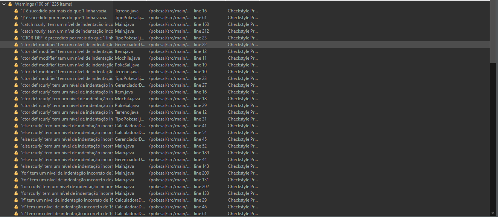
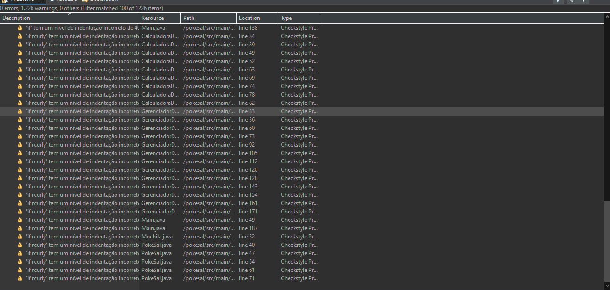
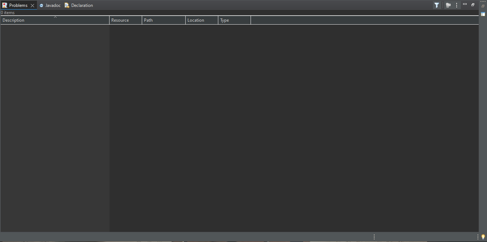

# 🧹 Relatório de Conformidade - Checkstyle (Google Java Style)

**Projeto:** Simulador de Batalha - PokeSal  
**Fase:** 01  
**Responsável:** Cauã Lopes  

---

## 📌 Visão Geral

Este documento registra o processo de adequação do código-fonte do projeto **PokeSal** às diretrizes do **Google Java Style Guide**, cobrindo padronização de nomenclatura, remoção de números mágicos, limitação de largura de linha e inclusão obrigatória de documentação Javadoc.

---

## 📸 Evidências de Validação

### 1. Diagnóstico Inicial (Antes da Refatoração)
A análise estática inicial via plugin do Checkstyle no Eclipse apontou um total de **1.226 avisos/warnings**, concentrados em inconsistências de indentação, falta de Javadoc e quebras de linha fora do padrão.

---

### 2. Resultado Final (Após Refatoração e Javadoc)
Após a reformatting automatizada do código, ajuste manual dos blocos de Javadoc e limpeza de imports, todos os arquivos `.java` do projeto atingiram **0 avisos/warnings** no Checkstyle.

